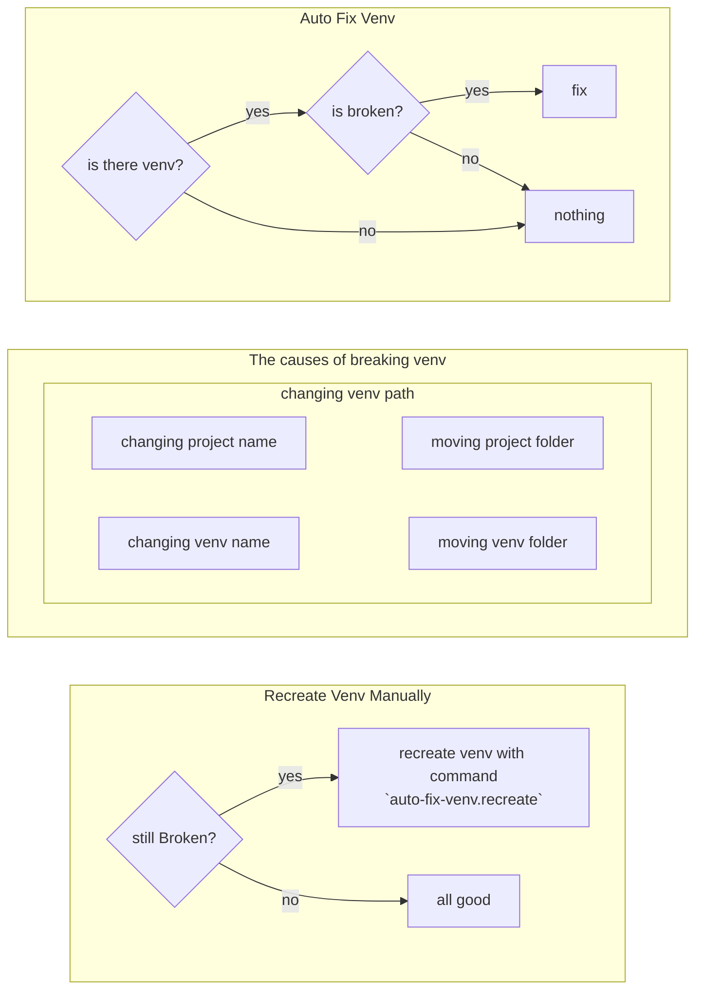

# Auto Fix Venv

Automatically detect broken python venv and fix it.
(Currently works only in windows)

<!--  -->

<!-- # Feature

- Automatically detect broken venv and fix it.
- Recreate venv with command `auto-fix-venv.recreate` when auto-fix not working. -->

# Keybindings

Nothing

# Extension Settings

Nothing
