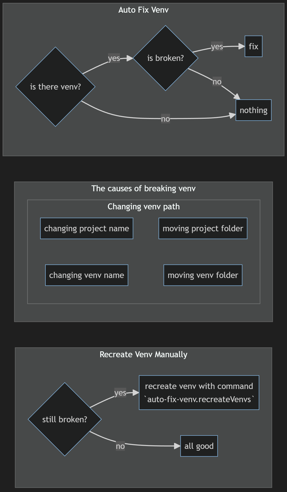

# Auto Fix Venv

Automatically detect broken python venv and fix it.
Support Windows,Linux and Mac.

## Features

- Detect multiple venvs dynamically
- Auto-Fix venv's activate files (activate,activate.bat,activate.csh,activate.fish,activate.nu)

## Upcoming Features

- `Recreate Venvs` command
  - Some options
  - Error check

## Keybindings

Nothing

## Extension Settings

Coming soon
