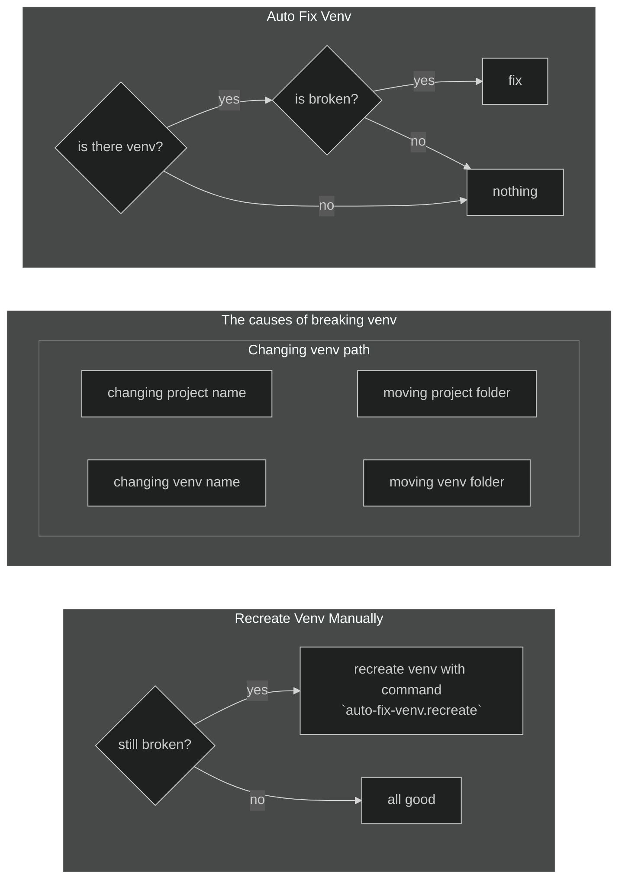

```mermaid
    %%{init: {'theme':'dark'}}%%
    flowchart TB;
        subgraph AutoFixVenv[Auto Fix Venv]
            direction LR
            venvExists{is there venv?}
            venvExists -- yes --> isBroken
                isBroken{is broken?}
                isBroken -- yes --> fix
                isBroken -- no --> nothing
            venvExists -- no --> nothing
        end

        subgraph Causes[The causes of breaking venv]
            subgraph ChangeVenvPath[Changing venv path]
                direction LR
                1[changing project name]
                2[moving project folder]
                3[changing venv name]
                4[moving venv folder]
                1 ~~~ 2
                3 ~~~ 4
            end
        end

        subgraph RecreateVenv[Recreate Venv Manually]
            direction LR
            stillBroken{still broken?}
            stillBroken -- yes --> recreate[recreate venv with command\n`auto-fix-venv.recreate`]
            stillBroken -- no --> allGood[all good]
        end

        AutoFixVenv ~~~ Causes ~~~ RecreateVenv
```
